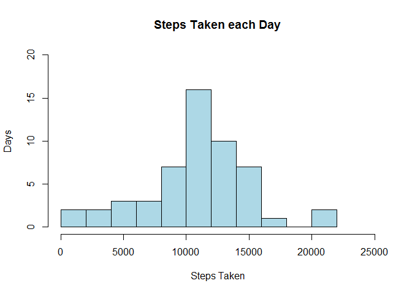
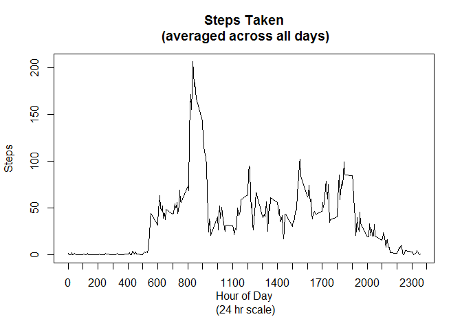
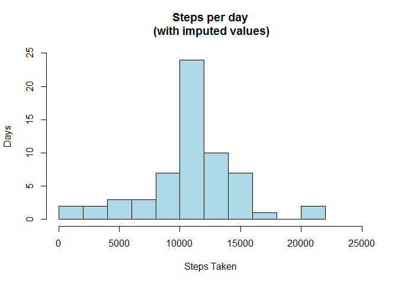

# Reproducible Research: Peer Assessment 1


## Loading and preprocessing the data
#### Begin by pulling in all data from activity.csv file to a simple data frame.

```r
dfall<-read.csv("activity.csv")
```

#### Next pull out records containing NAs.

```r
##Filter out NA values
df<-dfall[complete.cases(dfall),]
```

#### After that, build a simple histogram of the Steps taken each day.

```r
##aggregate mean of steps based on date
stps<-aggregate(df$steps, by=list(df$date), FUN=sum)
names(stps)<-c("stepDate","steps")

hist(stps$steps, main="Steps Taken each Day", xlab="Steps Taken", ylab="Days", ylim=c(0,20), xlim=c(0,25000), breaks=9, col="lightblue")
```

 


## What is mean total number of steps taken per day?
#### The mean and median of the steps taken is found by the simple code below

```r
mean(stps$steps)
```

```
## [1] 10766.19
```

```r
median(stps$steps)
```

```
## [1] 10765
```


## What is the average daily activity pattern?
#### Provided below is the average daily activity across all days on a 24 hr scale where 0 = 12:00 am and 2355 = 11:55 pm.

```r
intrvls<-aggregate(df, by=list(df$interval), FUN=mean)

plot(steps~interval, intrvls, type="l", xaxt="n", xlab="Hour of Day\n (24 hr scale)", ylab="Steps", main="Steps Taken\n (averaged across all days)")
axis(1,at=(seq(from=0, to=2400, by=100)))
```

 

#### As you can see the highest spike in activity occurs at the interval identified below and shows us that morning commute time seems to be the highest activity time as pertaining to average steps for a given 5 minute interval. 

```r
intrvls[intrvls$steps==max(intrvls$steps),4]
```

```
## [1] 835
```

## Imputing missing values
#### Begin by isolating the NA values...The number of which is itemized below as well.

```r
dfna<-dfall[!complete.cases(dfall),]
nrow(dfna)
```

```
## [1] 2304
```
#### Then take the all set and the computed average steps per interval and use this to build a single set of values with NA values replaced with the average for the interval across all days.

```r
##add interval average as a new column
dftest<-merge(dfall, intrvls, by.x="interval", by.y="interval")
##set steps = avgsteps for the interval where value is NA
my.na <-is.na(dftest$steps.x)
dftest$steps.x[my.na]<-dftest$steps.y[my.na]

dfImputed<-dftest[,c("steps.x","date.x","interval")]
colnames(dfImputed)<-c("steps","date","interval")
```

#### Finally, use this dataset (with imputed data) to look at the histogram of average steps taken.

```r
stpsImputed<-aggregate(dfImputed$steps, by=list(dfImputed$date), FUN=sum)
names(stpsImputed)<-c("stepDate","steps")
hist(stpsImputed$steps, main="Steps per day\n (with imputed values)", xlab="Steps Taken", ylab="Days", ylim=c(0,25), xlim=c(0,25000), breaks=9, col="lightblue")
```

 

```r
mean(stpsImputed$steps)
```

```
## [1] 10766.19
```

```r
median(stpsImputed$steps)
```

```
## [1] 10766.19
```


## Are there differences in activity patterns between weekdays and weekends?
#### When describing the difference between the weekday and weekend activity patterns we need to first add a new factor of weekday or weekend to the dataset based on the date.

```r
dfImputed$daytype<-ifelse(weekdays(as.Date(dfImputed$date)) %in% c("Saturday","Sunday"), "weekend", "weekday")
dfImputed$daytype <- as.factor(dfImputed$daytype)
```

After adding this factor we can now visualize the difference between activity during the week and the weekend.

```r
library(ggplot2)
attach(dfImputed)
intrvlsImputedWT<-aggregate(dfImputed, by=list(interval,daytype), FUN=mean)
qplot(interval, steps, data=intrvlsImputedWT, facets=Group.2~., geom="line")
```

 

#### In conclusion, the weekday and weekend activity patterns are very similar but seem to show a higher spike during the week and it also seems to show that  activity starts later on the weekend; maybe this just proves people like to sleep-in on the weekend.
